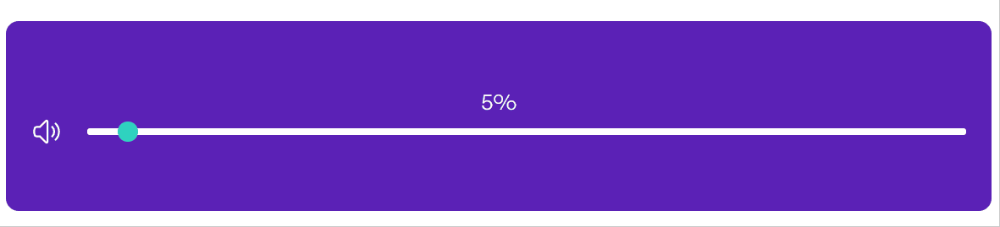

# Complex Slider

Sometimes, you need a slider on your website, for the user to interact with
volume for example.

Sliders have become a normal way to manage different parameters on websites, so
normal actually that it became quite **boring**. Moving a cursor from right to
left is a bit repetitive isn't it?

**Introducing the complex slider**, the only slider that can provide your sound
system with very useful complex values such as `-4 + -63i` percents of volume.
Who's bored now?



## Usage

To use this on your website, simply :

1) Download the script `complex-slider.js` and the styles `complex-slider.css`.
2) Import the styles file on the HTML page you want to use complex sliders on.
3) Insert the HTML and JavaScript snippets you'll find below.
4) And Voilà! Your website is ready to handle complex volume values.

Use this code snippet wherever you want to insert a complex slider on your page.

```html
<div class="complex-slider">
    <div class="complex-slider-text">
        47%
    </div>
    <div class="complex-slider-row">
        <svg class="complex-slider-icon" xmlns="http://www.w3.org/2000/svg" fill="none" viewBox="0 0 24 24" stroke-width="1.5" stroke="currentColor" width="24" height="24">
            <path stroke-linecap="round" stroke-linejoin="round" d="M19.114 5.636a9 9 0 010 12.728M16.463 8.288a5.25 5.25 0 010 7.424M6.75 8.25l4.72-4.72a.75.75 0 011.28.53v15.88a.75.75 0 01-1.28.53l-4.72-4.72H4.51c-.88 0-1.704-.507-1.938-1.354A9.01 9.01 0 012.25 12c0-.83.112-1.633.322-2.396C2.806 8.756 3.63 8.25 4.51 8.25H6.75z" />
        </svg>
        <div class="complex-slider-line"></div>
        <div class="complex-slider-circle"></div>
    </div>
</div>
```

Copy this script tag at the end of the body of the page. Change the path to the
`complex-slider.js` module if necessary.

```html
<script type="module" src="complex-slider.js"></script>
<script type="module">
    import ComplexSlidersManager from "./complex-slider.js";

    ComplexSlidersManager.init();
</script>
```

## Contribution

As you can guess, this is the future. Simple sliders will soon vanish from the
surface of the Internet, as we'll use complex sliders only. Just look at the
practical benefits it gives us.

Therefore, all contribution would be greatly appreciated, such as :

- Writing some code and opening pull-requests. Feel free to do so, I'll gladly
review and approve them.
- Reporting bugs or sharing ideas about the complex slider, because remember,
this is the future, and we need to make it bug-free and implement as many
useful features as possible.

## Credits

The icon of speaker was provided by [heroicons](https://heroicons.com/).

Colors have been picked from [Tailwind CSS palette](https://tailwindcss.com/docs/customizing-colors#default-color-palette).

The demo GIF has been made using the very nice to use [ScreenToGif](https://www.screentogif.com/).

The idea of creating this script came when watching [this YouTube Short](https://www.youtube.com/shorts/Ocs00dEpqXg).

## Versioning

This script follow the [semantic versioning](https://semver.org) principles.

## License

The code found on this repository is provided under GPL v3, please read the
[LICENSE](LICENSE) document for more information.